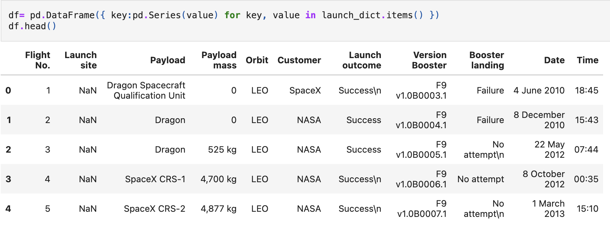
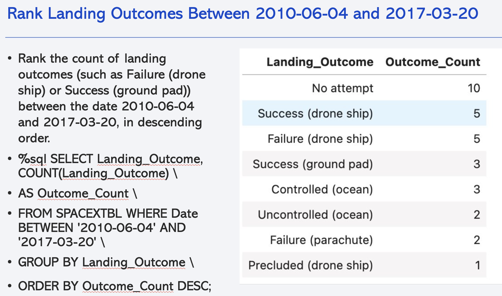

# IBM Data Science Professional Certificate Portfolio

## Overview

This repository showcases my journey through the IBM Data Science Professional Certificate program. The portfolio highlights my proficiency in data science tools, methodologies, and applications, demonstrated through a series of projects that reflect real-world scenarios. Each project aligns with the skills and knowledge necessary for a data scientist, culminating in this capstone project forecasting SpaceX rocket launch success: [report](https://github.com/rexcoleman/IBMDataScienceProfessionalSpecialization/blob/main/Capstone_Project_WinningTheSpaceRaceWithDataScience.pdf), [code](https://github.com/rexcoleman/IBMDataScienceProfessionalSpecialization/tree/main/C_10_AppliedDataScienceCapstone).

## Certificate Highlights

- **Comprehensive Skill Set:** Master the practical skills used by data scientists, including Python, SQL, data visualization, and machine learning.
- **Real-World Applications:** Implement data science techniques to solve practical problems in various domains.
- **Professional Tools:** Work with essential tools like Jupyter notebooks, GitHub, RStudio, and IBM Watson Studio.
- **Portfolio Projects:** Develop a diverse portfolio that showcases data extraction, analysis, visualization, and machine learning models.

## Courses and Key Projects

### Course 1: What is Data Science?
**Overview:** Understand the fundamentals of data science and its significance.
**Key Project:** Define data science, explore career paths, and gather insights from seasoned professionals.

### Course 2: Tools for Data Science
**Overview:** Get acquainted with the essential tools in a data scientist's toolkit.
**Key Project:** Utilize tools like Python, R, SQL, Jupyter notebooks, and GitHub.

### Course 3: Data Science Methodology
**Overview:** Learn the structured approach to tackling data science problems.
**Key Project:** Apply the CRISP-DM methodology to analyze case studies.

### Course 4: Python for Data Science, AI & Development
**Overview:** Gain proficiency in Python programming for data science.
**Key Project:** Develop Python code using libraries like Pandas and Numpy.

*Figure 1: [HTML Tables](https://en.wikipedia.org/wiki/List_of_Falcon_9_and_Falcon_Heavy_launches) showing list of Falcon 9 and Falcon Heavy launches.*

*Figure 1: Result Pandas DataFrame from BeautifulSoup webscraping.*

### Course 5: Python Project for Data Science
**Overview:** Work on a real-world data science project using Python.
**Key Project:** Apply Python fundamentals and data structures to analyze data.

### Course 6: Databases and SQL for Data Science with Python
**Overview:** Analyze and manage data using SQL and Python.
**Key Project:** Create and query relational databases, utilizing advanced SQL techniques.

*Figure 3: SQL analysis ranking landing outcomes between 2010-06-04 and 2017-03-20.*

### [Course 7: Data Analysis with Python](https://github.com/rexcoleman/IBMDataScienceProfessionalSpecialization/tree/main/C_7_DataAnalysisWithPython)
**Overview:** Perform data cleaning, preparation, and exploratory analysis.
**Key Project:** Manipulate and analyze datasets using Pandas, Numpy, and Scipy.

### [Course 8: Data Visualization with Python](https://github.com/rexcoleman/IBMDataScienceProfessionalSpecialization/tree/main/C8_DataVisualizationWithPython)
**Overview:** Implement data visualization techniques to tell compelling stories.
**Key Project:** Create various charts and plots using Matplotlib, Seaborn, and Folium.

### [Course 9: Machine Learning with Python](https://github.com/rexcoleman/IBMDataScienceProfessionalSpecialization/tree/main/C9_MachineLearningWithPyton)
**Overview:** Understand and implement machine learning algorithms.
**Key Project:** Write Python code for classification techniques like KNN and decision trees.

### [Course 10: Applied Data Science Capstone](https://github.com/rexcoleman/IBMDataScienceProfessionalSpecialization/tree/main/C_10_AppliedDataScienceCapstone)
**Overview:** Demonstrate proficiency through a comprehensive capstone project.
**Key Project:** Perform data wrangling, EDA, model development, and evaluation.

### Course 11: Generative AI: Elevate Your Data Science Career
**Overview:** Leverage generative AI tools to enhance data science workflows.
**Key Project:** Generate and augment datasets using tools like GPT-3.5 and tomat.ai.

### Course 12: Data Scientist Career Guide and Interview Preparation
**Overview:** Prepare for a data science career with job search strategies and interview tips.
**Key Project:** Build a resume, portfolio, and practice interview techniques.

## Conclusion

This portfolio not only demonstrates my technical skills and knowledge but also my ability to apply them to real-world problems. Each project is a testament to my journey through the IBM Data Science Professional Certificate program and my readiness to excel as a data scientist.

Explore the projects and witness the impact of data science in action!

## Certificate Verification

[Certificate](https://www.coursera.org/account/accomplishments/professional-cert/Q5Q6H87SM9S9)
